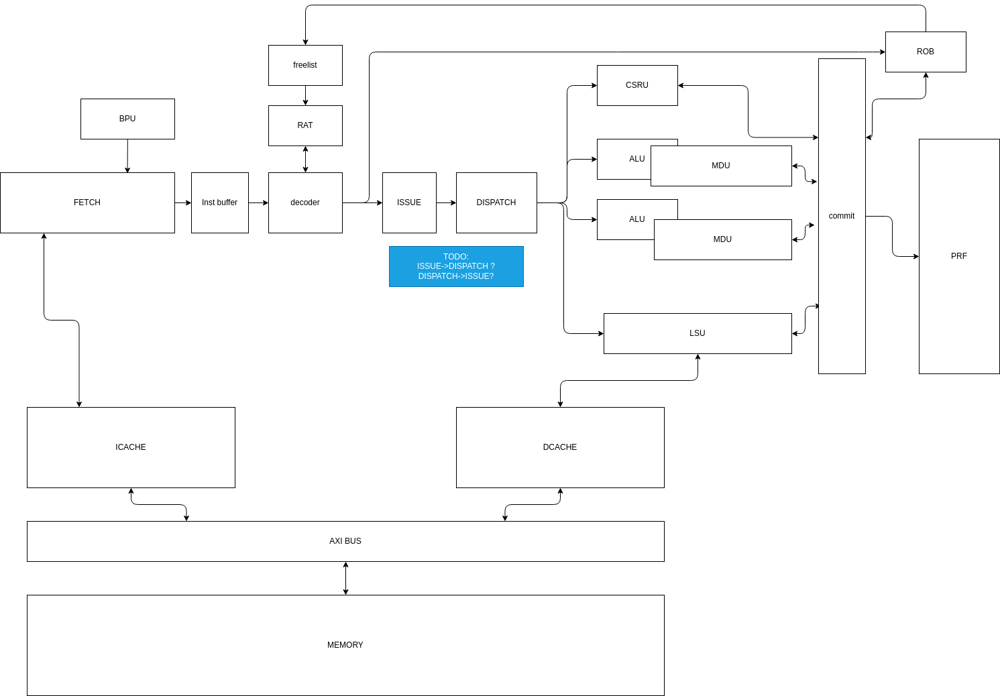

# Core Spec 

## Front 
This manual is for the special of this project . And in this document, I will descrip the constraints we will comply when we designing .

We use the RISC-V ISA(Instructions Set Architecture) to design our core . And,the RISC-V has many sub ISA could be selected to integrate to our design .

Our target is making a good core .So,We would selected the ysyx project-A,to make a RISC-V core with the sub-ISA I,A,M,C,and 64-bits . 

| Support ISA |
|-------------|
| I           |
| A           |
| M           |
| C           |

| Support machine width |
|-----|
|  64 |

Base on those supports, We will make a SuperScalar Processor . In order to maximize the performance of our design within the scope of our capabilities , it was decided to design an out-of-order machine .

In the current status , I think this core has the following parameters .

| parameter name                | parameters |
|----------------               |------------|
| machine width                 |    $2$/$4$ |
| issue width                   |    $2$/$4$ |
| Dynamic Branch Predictor Unit | integrated |
| Renaming mapping table        | CAM Base   |
| Renaming machanism            | PRF Base   |
| CheckPoints Support           | Yes        |
| Functions Units Numbers       | unknown    |

Recommand : $Machine\ Width > Issue\ Width$  .

## Module Guide 
Standardize all modules in this chap.

### Architecture Figure
 

### Modules
apply some informations ....

## Ports Guide
apply some informations ....
## Bus Guide
apply some informations ....
## Memory Mapping
apply some informations ....
